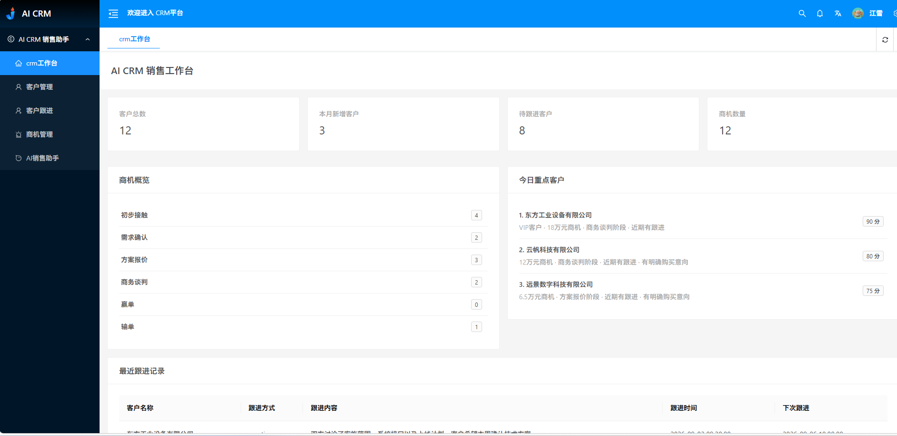
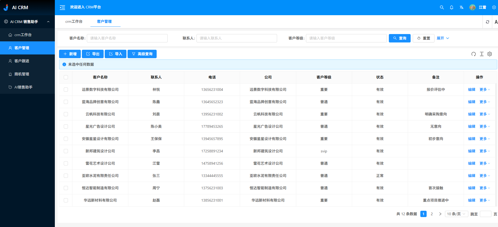
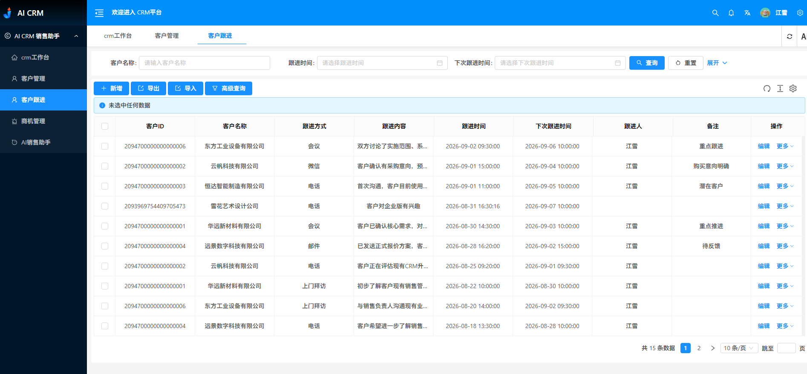
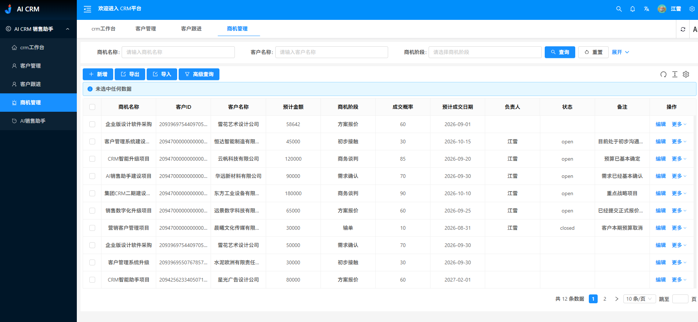
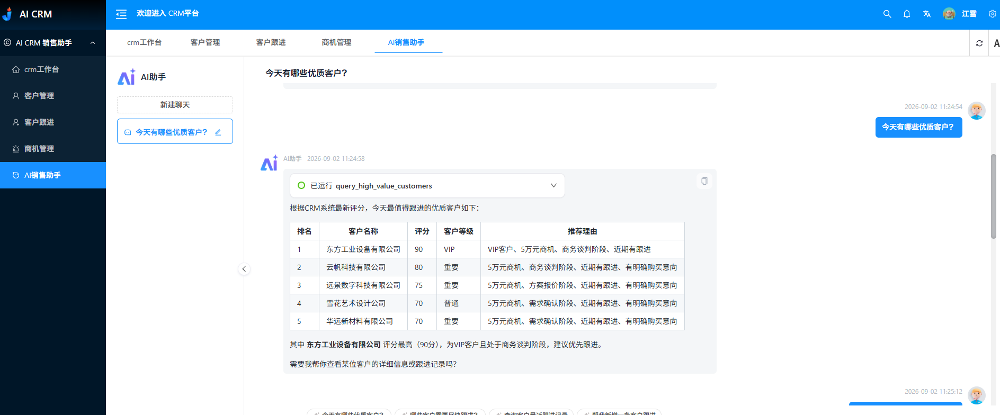
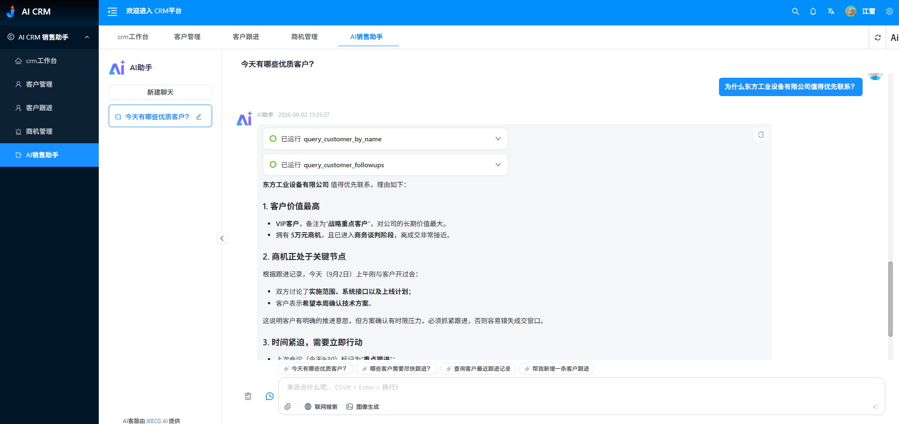
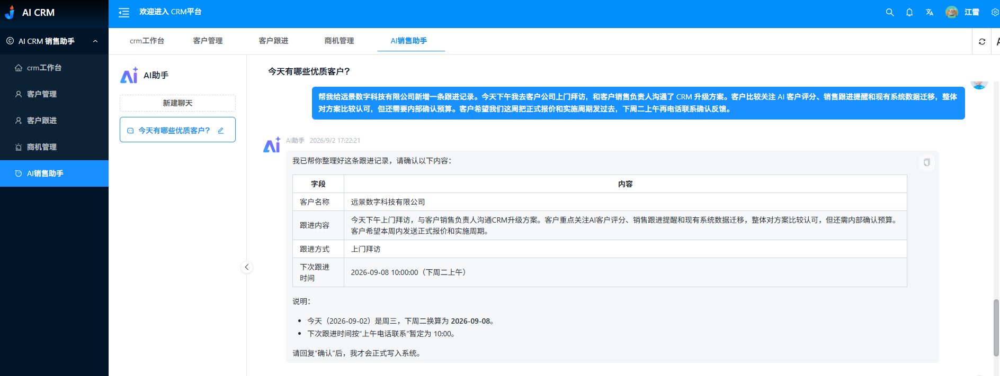

# AI CRM Sales Assistant

基于 **JeecgBoot 3.9.5** 二次开发的 AI CRM Sales Assistant Demo。

项目将传统 CRM 的客户、跟进、商机数据与 **LLM Tool Calling** 结合，让销售人员可以直接通过自然语言完成客户查询、跟进查询、重点客户推荐以及新增跟进等操作。

> 项目定位：不是做一套完整 CRM 产品，而是验证 **AI Agent 如何接入真实 Java 业务系统，并安全地查询、分析和操作企业数据**。

---

## ✨ 核心能力

### CRM 业务

- CRM 销售工作台
- 客户管理
- 客户跟进管理
- 商机管理
- 商机阶段统计
- 待跟进客户统计
- 最近跟进记录
- 今日重点客户推荐

### AI Sales Assistant

- 自然语言查询客户
- 查询客户历史跟进
- 高价值客户评分
- 推荐今日优先联系客户
- 解释客户推荐原因
- 自然语言新增跟进记录
- 数据库写操作确认
- 多 Tool 连续调用

---

## 🖼 项目截图

> 将截图放入 `screenshots/` 目录后即可在 GitHub / Gitee README 中直接显示。

### CRM 销售工作台



### 客户管理



### 客户跟进



### 商机管理



### AI 优质客户推荐



### AI 推荐原因分析



### AI 新增客户跟进



---

## 🎬 Demo 演示

建议演示流程：

1. 打开 CRM 销售工作台
2. 查看客户、跟进、商机数据
3. 进入 AI 销售助手
4. 输入：`今天有哪些优质客户？`
5. AI 调用客户评分 Tool 并返回排名
6. 继续追问：`为什么东方工业设备有限公司值得优先联系？`
7. AI 自动查询客户资料与跟进记录并综合分析
8. 输入一段自然语言销售记录
9. AI 提取客户、跟进方式、跟进内容、下次跟进时间
10. 用户确认后写入 CRM 数据库

---

## 🧠 AI Tool Calling

目前实现 4 个核心 CRM Tool。

### `query_customer_by_name`

根据客户名称查询 CRM 客户资料，支持模糊查询。

示例：

```text
查询东方工业设备有限公司
```

---

### `query_customer_followups`

根据客户名称查询历史跟进记录，并按时间返回近期沟通情况。

示例：

```text
东方工业设备有限公司最近跟进过什么？
```

---

### `query_high_value_customers`

根据 CRM 中的客户、商机、跟进数据，由 Java 业务规则计算客户价值评分。

示例：

```text
今天有哪些优质客户？
```

```text
今天我最应该联系哪 3 个客户？
```

---

### `create_customer_followup`

将销售人员的一段自然语言工作记录解析为结构化 CRM 跟进数据。

示例：

```text
帮我给远景数字科技有限公司新增一条跟进记录。

今天下午我去客户公司上门拜访，
和客户销售负责人沟通了 CRM 升级方案。
客户比较关注 AI 客户评分、销售跟进提醒和现有系统数据迁移，
整体对方案比较认可，但还需要内部确认预算。

客户希望我们这周把正式报价和实施周期发过去，
下周二上午再电话联系确认反馈。
```

AI 可以提取：

```text
客户：远景数字科技有限公司
跟进方式：上门拜访
跟进内容：CRM 升级方案沟通情况
下次跟进：下周二上午
```

涉及数据库写操作时，必须经过用户确认后才允许执行。

---

## 🔒 写操作确认

AI 不直接执行数据库写入。

写操作采用两阶段流程：

```text
用户自然语言
        ↓
LLM 提取结构化参数
        ↓
Tool 返回 NEED_CONFIRMATION
        ↓
AI 展示待新增内容
        ↓
用户明确确认
        ↓
create_customer_followup
        ↓
写入 MySQL
```

Java 层会再次判断：

```text
confirmed == true
```

只有用户明确确认后，才允许调用 Mapper 执行 INSERT。

---

## 📊 客户价值评分

客户价值评分由 **Java Service** 统一计算，而不是让 LLM 自由判断。

当前 Demo 规则包括：

| 条件 | 分数 |
|---|---:|
| VIP 客户 | +20 |
| 存在有效商机 | +20 |
| 商机金额 ≥ 5 万元 | +15 |
| 需求确认阶段 | +15 |
| 方案报价阶段 | +20 |
| 商务谈判阶段 | +25 |
| 7 天内有跟进 | +10 |
| 跟进记录存在明确购买意向 | +10 |
| 30 天以上未跟进 | -15 |
| 输单 | -30 |

同一套评分 Service 同时被：

- CRM 工作台
- AI `query_high_value_customers` Tool

共同调用。

因此工作台排名和 AI 推荐保持一致。

---

## 🏗 Agent 架构

```text
User
  ↓
LLM
  ↓
Tool Specification
  ↓
Tool Executor
  ↓
CRM Service
  ↓
Mapper / MyBatis-Plus
  ↓
MySQL
  ↓
JSON Result
  ↓
LLM Response
```

### 设计原则

LLM 负责：

- 理解自然语言
- 选择合适 Tool
- 提取参数
- 组合多个 Tool
- 组织最终回答

Java 业务层负责：

- 数据权限
- 数据查询
- 业务规则
- 客户评分
- 参数校验
- 写操作确认
- 数据库写入

> 关键业务规则放在 Java / SQL 层，而不是依赖模型临时判断。

---

## 🗃 核心业务模型

### Customer

客户基础信息：

```text
crm_customer
```

主要字段：

- 客户名称
- 联系人
- 电话
- 公司
- 客户等级
- 状态
- 备注

---

### FollowUp

客户跟进记录：

```text
crm_followup
```

主要字段：

- 客户 ID
- 客户名称
- 跟进方式
- 跟进内容
- 跟进时间
- 下次跟进时间
- 跟进人
- 备注

---

### Opportunity

销售商机：

```text
crm_opportunity
```

主要字段：

- 商机名称
- 客户
- 预计金额
- 商机阶段
- 成交概率
- 预计成交日期
- 负责人
- 状态
- 备注

商机阶段：

```text
初步接触
需求确认
方案报价
商务谈判
赢单
输单
```

---

## 📈 CRM 销售工作台

工作台数据全部来自真实 CRM 数据库，包括：

- 客户总数
- 本月新增客户
- 待跟进客户
- 商机数量
- 商机阶段分布
- 今日重点客户
- 最近跟进记录

工作台和 AI 推荐共用同一套客户评分 Service。

---

## 🛠 技术栈

### Backend

- Java 17
- Spring Boot
- JeecgBoot 3.9.5
- MyBatis-Plus
- MySQL
- Redis
- Maven

### Frontend

- Vue 3
- TypeScript
- Ant Design Vue
- JeecgBoot Vue3
- pnpm
- Vite

### AI

- LLM
- Tool Calling
- Tool Specification
- Tool Executor

---

## 🚀 本地运行

### 环境

建议准备：

```text
JDK 17
Maven
MySQL
Redis
Node.js
pnpm
```

### 后端

配置 MySQL、Redis 及模型相关参数后启动 JeecgBoot 后端。

如使用 Maven profile，可根据项目环境执行对应命令，例如：

```bash
mvn clean package -Pdev -DskipTests
```

然后通过 IDEA 或命令行启动 Spring Boot 服务。

### 前端

进入 Vue3 项目目录：

```bash
pnpm install
pnpm dev
```

默认开发端口可根据本地配置调整。

---

## 📁 README 截图目录建议

```text
screenshots/
├── 01-dashboard.png
├── 02-customer.png
├── 03-followup.png
├── 04-opportunity.png
├── 05-ai-ranking.png
├── 06-ai-reason.png
└── 07-ai-create-followup.png
```

---

## 💡 项目亮点

### 1. 不只是聊天机器人

AI 查询的是 CRM 中的真实业务数据，而不是仅基于 Prompt 生成答案。

### 2. Tool Calling 与业务系统结合

LLM 通过 Tool Specification / Tool Executor 调用 Java CRM 能力。

### 3. 关键规则确定性执行

客户评分等核心规则由 Java Service 负责，避免模型每次自由判断导致结果不稳定。

### 4. 支持多 Tool 协作

例如：

```text
为什么东方工业设备有限公司值得优先联系？
```

AI 可以结合：

```text
客户资料
+
客户跟进
+
之前的客户评分上下文
```

生成完整解释。

### 5. AI 可以执行写操作，但受到业务约束

新增跟进必须经过用户明确确认，Java 层再执行数据库写入。

### 6. 面向真实销售场景

核心价值不是替代 CRM，而是减少销售人员：

- 点菜单
- 设置筛选条件
- 查表
- 查历史记录
- 判断客户优先级
- 手工录入跟进

等重复操作。

---

## 🎯 项目定位

这个项目主要用于展示：

- Java / Spring Boot 企业应用开发
- JeecgBoot 二次开发
- CRM 业务建模
- MySQL / MyBatis-Plus
- 前后端联调
- AI Tool Calling
- LLM 与企业业务系统集成
- AI Agent 的安全写操作设计

项目没有试图实现完整的 Salesforce / Dynamics CRM，而是聚焦：

> **让 AI 成为 CRM 的自然语言操作入口，并让真正的业务规则仍然掌握在后端系统中。**

---

## 📌 后续可扩展方向

当前 Demo 已完成核心验证，后续可按实际业务需求扩展：

- 线索管理
- 联系人管理
- 产品管理
- 报价管理
- 订单管理
- 销售任务
- 更细粒度的数据权限
- 销售预测
- RAG / 企业知识库
- CRM API / ERP / OA 集成
- 更多写操作审批流程

---

## License

本项目基于 JeecgBoot 进行二次开发。

如公开发布源码，请遵循 JeecgBoot 及项目中各依赖组件对应的许可证和使用条款。
